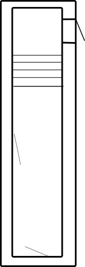

# Renovation

Il y a plusieurs chantiers dans ce projet:
* [Électricité](https://github.com/neilujman/Renovation/edit/main/README.md#%C3%A9lectricit%C3%A9)
* Plomberie
* Plancher
* Isolation
* Toiture
* Terrasse
* Aménagement :
  + Cuisine
  + Salle de bain

Évidemment, chaque chantier est interconnecté avec un ou plusieurs autres chantiers. Par exemple, l'aménagement de la cuisine nécessite d'y faire l'électricité et la plomberie.

## Électricité
### Câblage du couloir du T2
On veut câbler le couloir du T2 dont voici le plan:

