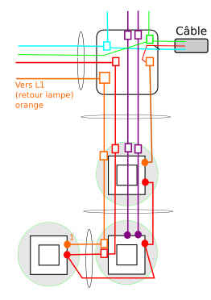

# Renovation

Il y a plusieurs chantiers dans ce projet:
* [Électricité](https://github.com/neilujman/Renovation/edit/main/README.md#%C3%A9lectricit%C3%A9)
* Plomberie
* Plancher
* Isolation
* Toiture
* Terrasse
* Aménagement :
  + Cuisine
  + Salle de bain

Évidemment, chaque chantier est interconnecté avec un ou plusieurs autres chantiers. Par exemple, l'aménagement de la cuisine nécessite d'y faire l'électricité et la plomberie.

## Électricité

* [Couloir T2](https://github.com/neilujman/Renovation/blob/main/README.md#c%C3%A2blage-du-couloir-du-t2))
  + [Plan du couloir](plan-couloir)

### Câblage du couloir du T2
On veut câbler le couloir du T2 dont voici le plan :

(plan-couloir)

Plus précis, à coté de la porte d'entrée:

### Câblage du rez-de-chaussée du T2
On veut câbler le rez-de-chaussée du T2 dont voici le plan :

{width=200%,height=200%){plan-rdc}
